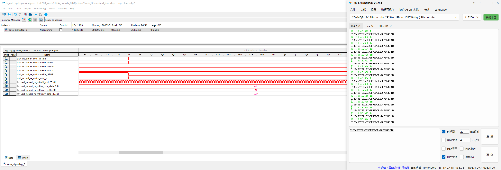
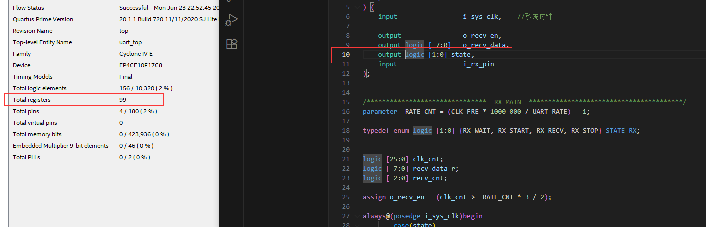
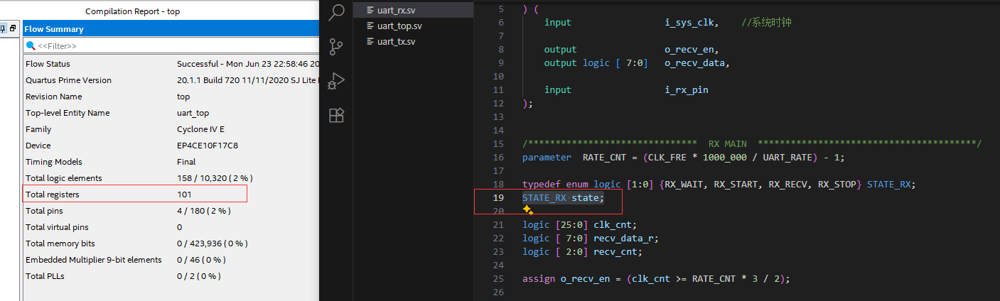
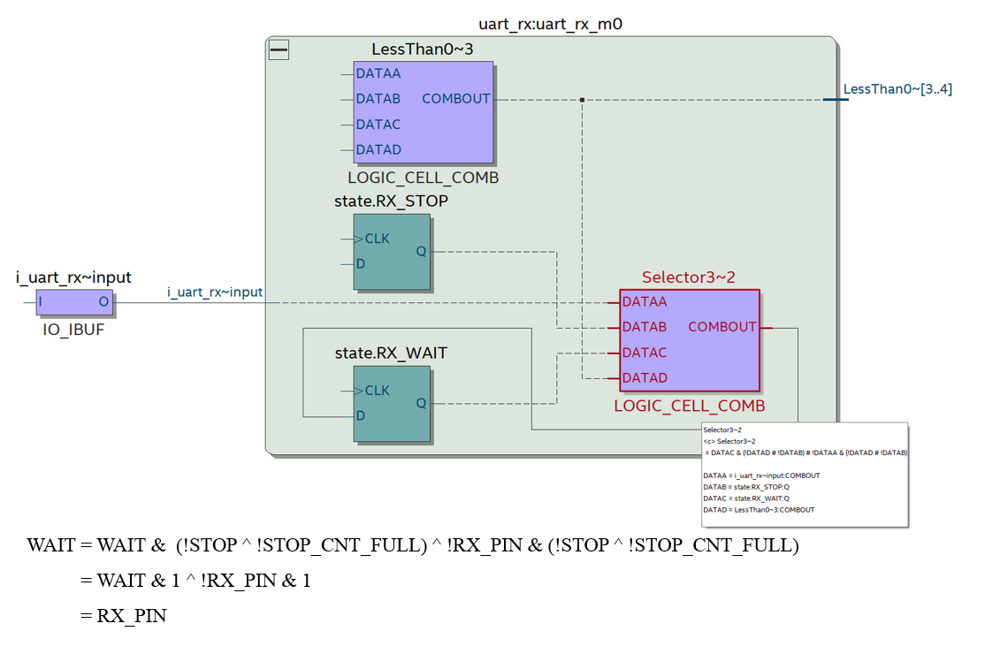
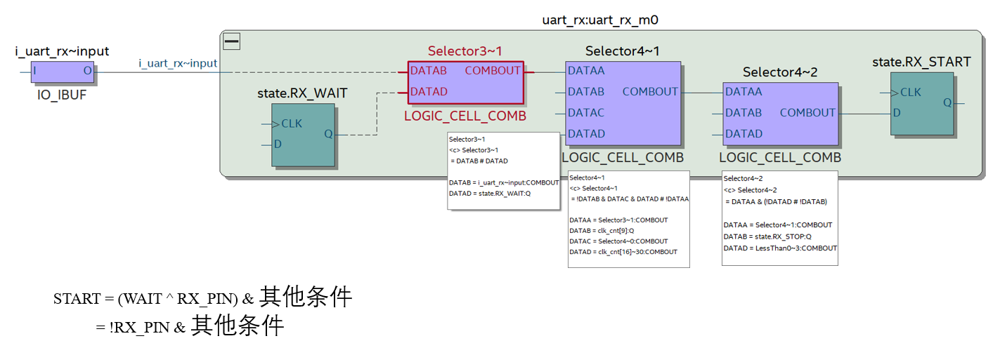

# 工程环境

+ FPGA开发板 ：AX301 （Cyclone IV )
+ PC端 支持快速连续发送的任意串口助手
+ PC端 Quartus（要用到signaltap ii，这儿是20.1 lite）

# 复现流程

- 1-打开工程
- 2-打开工程内的uart.stp
- 3-设置触发条件为RX_WAIT、RX_START、RX_RECV、RX_STOP状态都为0
- 4-下载，开始触发
- 5-电脑端打开串口助手，输入一个较长字符串，并以非常快的速度连续发送（最好是个位数ms，最快越好）
- 6-数秒后可观察到Signaltap串口触发，**四个状态全为0**，串口助手也进入TX卡死，不再回复回环数据

注：即使去掉Signaltap一样能触发该问题，使用Signaltap可以观察到具体问题

# 原因分析

* 1- Quartus识别到了这个状态机变量，即使它声明只有2个比特来表示4个状态，但是Quartus会把它综合成一个4比特独热码的状态机。这一点我们可以将sv的tydef对state声明改为output logic [1:0]，这样就会强制综合为一个2比特的变量。编译综合后可以观察到，确实减少了2个Registers的占用。

* 2- 独热码的状态切换必须将其中一个拉低，再将另一个拉高。此问题工程在于WAIT状态拉低后，并没有将START状态拉高——这也是最开始Signaltap观察到的现象。
* 3- 如果所有信号都是正常工作的，那么就应该一个状态拉低，另一个状态拉高——很明显WAIT和START的切换不正常，我们把这两个状态的综合后电路拉出来，取在WAIT状态下的表达式（毕竟下一个状态就异常了）

很明显在下一状态时，是因为WAIT状态读到了RX_PIN拉低，而START表达式并没有读到RX_PIN拉低，也就不会拉高——因为表达式的其他信号对状态机赋值都是同一时钟域，不存在时序问题（报告看得到）。因此可以断定，**RX_PIN在不同的地方被使用，但是不同的地方却采样到了不同的RX_PIN的值**——这是什么？这就是亚稳态。

另一个现象也可以佐证这个采样问题：使用串口调试助手时，手动发送几乎不会触发这个问题，必须以连续的大量的数据流才会触发，且停止位置几乎随机。

# 解决办法

+ 1- 根本上解决，必须将输入信号RX_PIN进行打拍，使其融入到rx_clk的时钟域中，**让RX_PIN的所有FAN OUT都能拿到统一的值**。具体打几拍，可以通过下列文章给出的计算解释，为什么现在的异步采样打拍都是2拍。

  [跨时钟域同步，为什么两级寄存器结构能够降低亚稳态？ - 知乎](https://www.zhihu.com/question/43571892)

​	  省流：我们无法根本上消除亚稳态的问题，但是可以通过打拍阻止其继续传播（相当于运放的跟随电路，我只传递你的值，不传递你的状态）。通过定量的计算得出，在现代芯片工艺和代码功能需求估计下，打一拍可以降低亚稳态的概率，但是不够；三拍又太长了；即使是两拍的概率已经到达以年为单位了。

+ 2- 治标不治本型，把state通过约束或者放到output，使其强制综合为固定比特的二进制状态机，而不是独热码，以避免状态机卡死的问题。

# 版本更新

230623：初始版本
